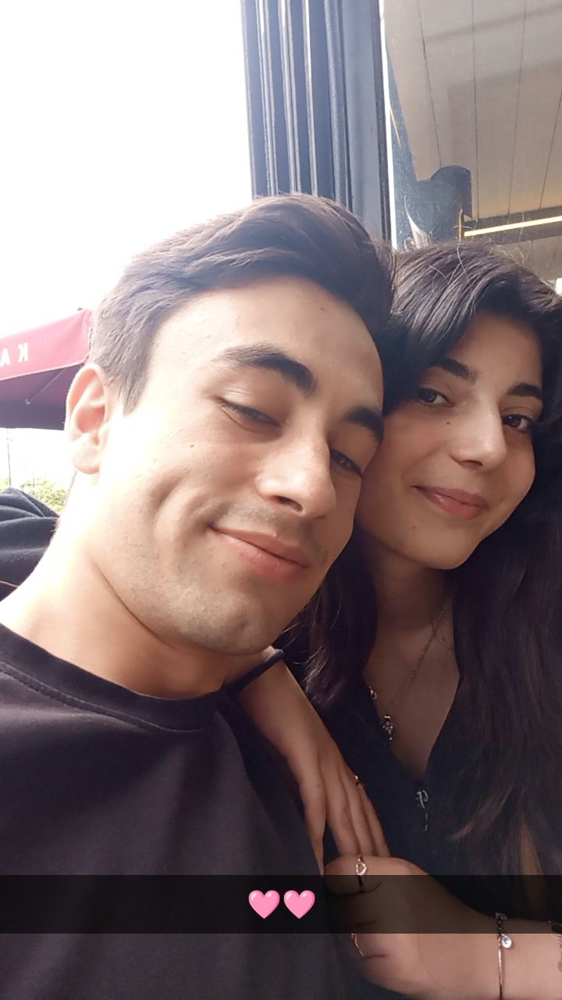

<!DOCTYPE html>
<html lang="tr">
<head>
  <meta charset="UTF-8">
  <title>Aleyna'ya</title>
  
</head>
<body>

  <!-- Uçuşan Kalpler -->
  

  

    <h1>Canım Aleyna'ya 💖</h1>

    

      Seninle tanıştığım günden beri hayatım daha anlamlı, daha huzurlu.  
      Gözlerinle aydınlanan günlerim, gülüşünle güzelleşiyor.  
      Bazen bir bakışın, bütün yorgunluğumu alıyor.  
      Sana her baktığımda "iyi ki" demekten kendimi alamıyorum.  
      Çünkü sen; kalbimin en güzel yerinde, en özel şekilde duran kişisin.  
      Zaman geçse de, her geçen gün sevgim biraz daha büyüyor.  
      Ve şunu bil ki: Ben seninle tamamlandım, seninle ben oldum, Aleyna.
    

    
❤️ 🌼 ❤️ 🌼 ❤️

    
Sabah uyandığımda aklıma ilk sen geliyorsun.

    
Sesin bile huzur veriyor, seni duymak bile yetiyor.

    
🌼 ❤️ 🌼 ❤️ 🌼

    
Beraber geçirdiğimiz her an, hafızamda bir şiir gibi.

    
Senin yanındayken zamanın nasıl geçtiğini bile anlamıyorum.

    
❤️ 🌼 ❤️ 🌼 ❤️

    
Seni seviyorum çünkü sen, olduğun halinle bile mükemmelsin.

    
Ve ben, her gün biraz daha sana aşık oluyorum.

    
💖 Seni çoook Seviyorum, Aleyna 💖

    

      <h3>🌸 Birlikte Anılarımız</h3>
      
      
      
    

  

  
</body>
</html>
